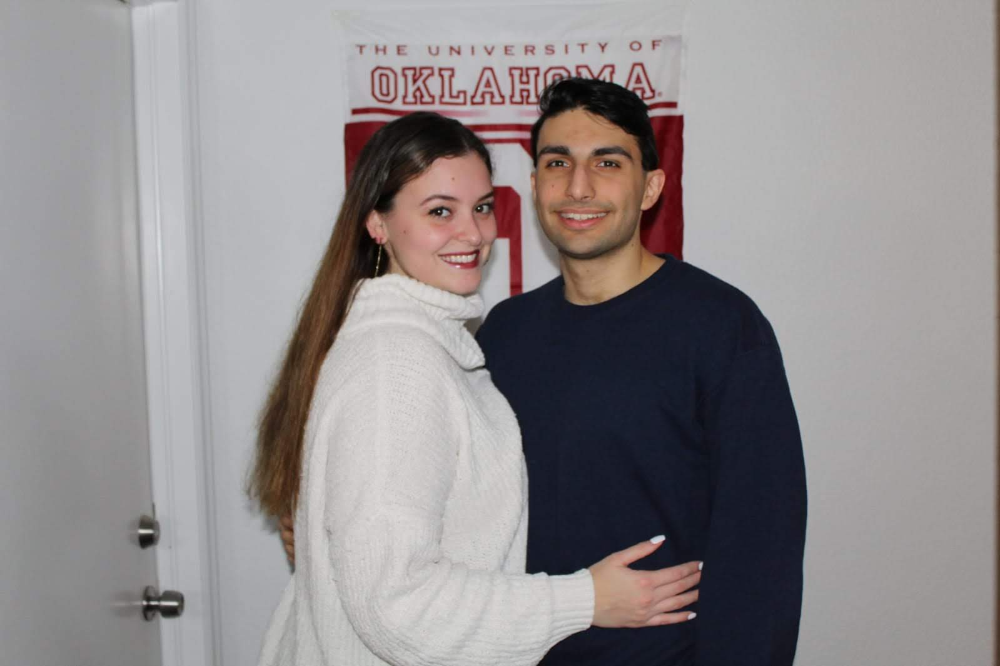

## About Me

  
   

I am a current Senior at the University of Oklahoma (OU) studying Computer Engineering with minors in Computer Science and Math

### Personal Work
Personal projects that I have worked on that are featured on my github:

1. [Coputer Visions for line detection.](https://github.com/PouyaT/map_projection)
2. [Bing Bot to gather Bing points.](https://github.com/PouyaT/BingBot)
3. [Reddit bot for OPTC subreddit.](https://github.com/PouyaT/OPTC-reddit-bot)

Projects I have worked on not featured on my github:
1. Clustering algorithm for 2D Wafer scans at Samsung Austin Semiconductor.
2. OCR detection tool for OU Robotics team.
3. Arduino and microcontroller work.

Link to my [Github Repositories](https://github.com/PouyaT)

Link to my <a href="https://github.com/PouyaT/PouyaT.github.io/blob/master/Resume.pdf" target="_blank">Resume</a>

### Contact

**Email:** 1pouya.tavakoli@gmail.com

**LinkedIn:** [LinkedIn link](https://www.linkedin.com/in/pouya-tavakoli-33726a14b/)

